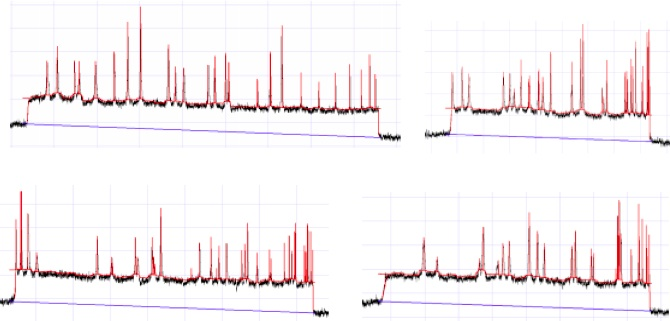
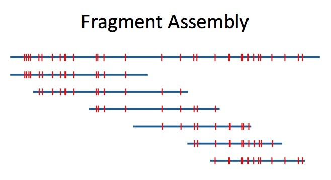

I worked at Nabsys from June 2011 to September 2013. My projects involved algorithms for signal processing and de novo assembly of DNA distance maps.

### OVERVIEW

Long DNA molecules are treated with a nicking enzyme to cut one of the two strands 
at sequence specific motifs and then bulky tag molecules are attached to the nick sites. 
After this, the DNA was translocated through a nanochannel and the current was measured. The current goes 
down when the DNA backbone enters the channel and down further when the tag molecules translocate
the channel. This gives us a measurement of the relative locations of this sequence specific motif. 

### SIGNAL PROCESSING

A distance map is analogous to an ordered restriction map or data produced by Bionanogenomic’s system. This image displays the 
output of the signal processing and feature extraction of the current trace. I led this project and managed one other computational biologist.

### DISTANCE MAP ASSEMBLY

These distance maps are useful for scaffolding assemblies of short read sequencing or for directly calling structural variants. The accuracy of these applications is greatly improved by first de novo assembling the distance map reads. Assembling the distance maps reduces distance error and false positive and false negative tag sites as well as creating much longer consensus maps. On this project I worked in collaboration with Franco Preparata and Eli Upfal, both of Brown University Computer Science. You can read more about this method on my <a href="../projects/patent2.pdf">white paper</a>. 

### MULTIPLE ALIGNMENT OF DISTANCE MAPS

An important aspect of the consensus step of the de novo assembly of distance maps is multiple alignment. 
Knowing which tags in each source molecule are the same as the tags in other source molecules allows for much
 more accurate averaging out of distance errors. 
Within a set of distance map reads, all pairwise alignments are done and a graph is created whereby each tag is a node 
and an alignment between two tags is an edge. With this reduction to a graph theoretical framework, we can use a known algorithm 
for finding min-cuts, Karger's algorithm, along with custom constraints, to find the optimal multiple alignment. 
I made an animated D3 example of how Karger's algorithm works <a href="../projects/kargers.html">here</a>.  
The details of this algorithm can be found on our <a href="../projects/patent2.pdf">white paper</a>.
