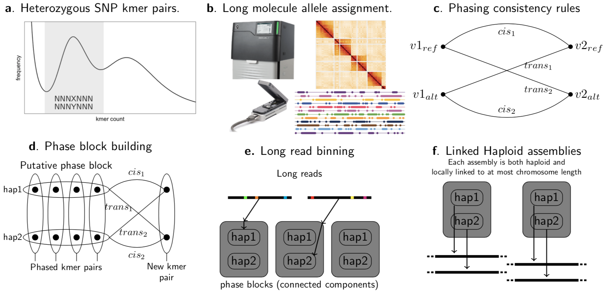

### OVERVIEW

Efforts have begun on the Earth Biogenome Project (EBP), a global project to sequence the entire diversity of multicellular eukaryotic life. 
In the UK, the Sanger Institute and partners have started to sequence 60,000 species from the British Isles in the Darwin Tree of Life (DToL) project. 
These projects aim to provide a scientific resource for the next generation of biological science, for environmental conservation, and to study evolution 
at a much broader and deeper scale than ever before. Long read assembly has come a long way toward producing highly contiguous and accurate genome assemblies. 
One of the primary remaining difficulties is high levels of heterozygosity such as found in many of the non-model organisms included in the EBG and DToL projects. 
When assembling a diploid or polyploid genome, inexact read matches must be determined to have arisen from sequencing errors, alternate haplotypes, 
or paralogous sequences. Current methods focus on assembling a primary haplotype and separating out as much as possible of the second haplotype after the 
fact. This can lead to errors when the incorrect inference is made about homology, or fragmented assemblies when the ambiguity is properly detected. 
Newer methods have used trios to haplotype bin reads prior to assembly, but often trios are not available. 
To address this problem, we have developed a method to phase reads from a single individual into haplotype specific bins prior to assembly. 
Our method is applicable to PacBio HiFi data and can use the additional information from linked reads and Hi-C if available. 

### phassta (phasing and assembly tools - assembly)

We first find heterozygous kmer pairs. To do this we generate the kmer count spectrum from one of the low error data types such as short reads 
(including linked reads) or PacBio HiFi and look for pairs of kmers that occur in the heterozygous count peak and vary only in the middle base. 
These kmer-pairs represent heterozygous single nucleotide polymorphisms in genome (Fig1a). 
We then find the instances of these kmers in all of the long range data types we have available including PacBio HiFi, HI-C, ONT, or linked reads (Fig 1b). 
Next we phase the kmer-pairs by looking at sets of kmers that occur on the same molecules. 
To do this we start with a random kmer pair and recruit other kmer pairs according to the number of their shared molecules. 
We only add kmer-pairs for which (almost) all linking molecules either link the new pair in cis or in trans, thus defining the phasing (Fig 1c). 
This requirement automatically avoids kmer-pairs that derive from paralogous sequences that by chance both have low coverage. 
Once maximal chains of phased kmer-pairs have been constructed (Fig 1d) the original reads are assigned to one phase or the other of each block
according to which heterozygous kmers they match (Fig 1e). We then assemble each haplotype of each phase block using miniasm 
with stricter than default parameters to account for the data being haploid and HiFi (Fig 1f). 

