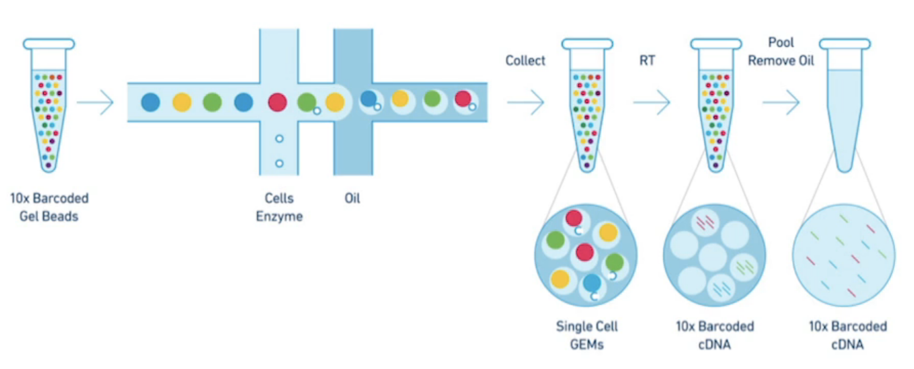
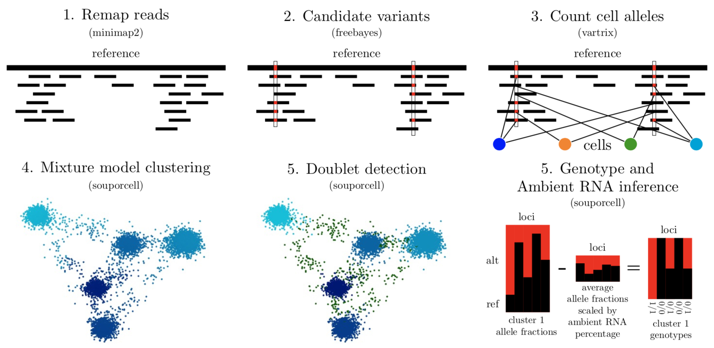

### Overview - single cell sequencing

The 10x Chromium single cell system uses a microfluidic system to create a reverse emulsion of aqueous solution with gel beads and usually 0-1 cell. The cell is lysed and reverse transcription followed by barcode attachment and amplification occur. This gives RNAseq reads barcoded by their cell of origin. I worked at 10x Genomics during the development of this system and while I primarily worked on the linked-read technology, I worked closely with the single cell computational biologists and biochemists and wrote significant code used in both longranger and cellranger.

### Souporcell

Multiplexing different individuals' cells into a single cell RNAseq experiment has many advantages as an experimental design primarily because it removes batch 
effects between samples but is also valuable for reducing cost per donor, providing information on both cross-genotype doublets and the amount of ambient RNA 
in the experiment. By using variants detected in scRNA-seq reads, it is possible to assign cells to their donor of origin and identify cross-genotype doublets 
that may have highly similar transcriptional profiles, precluding detection by transcriptional profile. More subtle cross-genotype variant contamination can be 
used to estimate the amount of ambient RNA. Ambient RNA is caused by cell lysis before droplet partitioning and is an important confounder of scRNA-seq analysis. 
Souporcell is a method to cluster cells using the genetic variants detected within the scRNA-seq reads.
