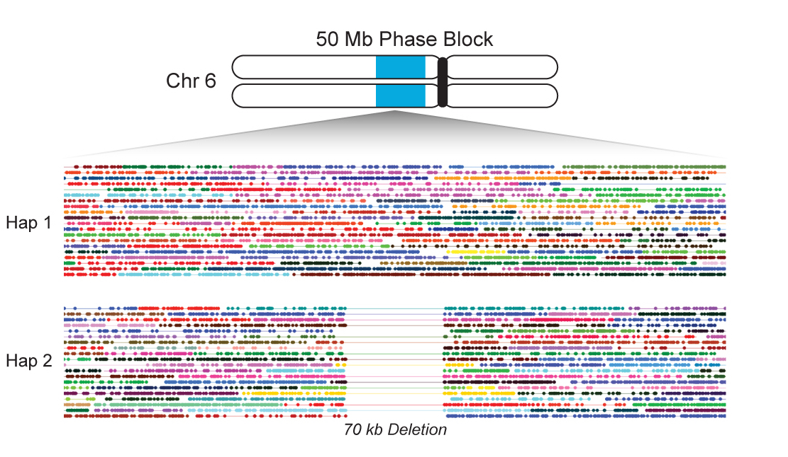

I have been at [10X Genomics](http://www.10xgenomics.com) since October 2014, when we were still stealth. My projects have been primarily on the DNA sequencing platform using molecular barcodes attached in emulsion to add long range genetic information to short read nextgen sequencing.

### OVERVIEW

The 10X platform starts with high molecular weight DNA input into a microfluidic system which partitions those long DNA molecules into "GEMs" (Gel bead in emulsion) with oil surrounding an aqueous solution containing the DNA and reagents surrounding a gel bead containing millions of copies of the same barcode DNA sequence. Each different gel bead has a different barcode DNA oligo with high probability. Each GEM gets roughly 10 long DNA molecules. So when you map the reads from a single barcodes, they cluster into a few small regions of the genome associated with their molecule of origin. This long range information can then be used to map into repeat regions of the genome, phase haplotypes, and call structural variation.

This can be done for either whole genome or targeted sequencing while retaining the linked read long range information.

### MAPPING REPEAT REGIONS OF THE GENOME

This long range genetic information allows us to map into repeat regions 
of the genome using either flanking unique sequence as is the case for short exact repeats or rare interspersed differences typical of 
segmental duplications. Segmental duplications are increasingly being recognized as the source of new gene creation as well as gene dosing variation. 
You can read more about this method on my white paper <a href="../projects/lariat.pdf">here</a>.

### PHASING LONG MOLECULES

The 10X platform can also be used for haplotype phasing. Each 

I’ve made significant contributions to the development of [Long Ranger](http://support.10xgenomics.com/genome-exome/software/pipelines/latest/what-is-long-ranger), our pipeline for analyzing 10X genome and exome data. I’ve also contributed to the design and analysis of a custom exome bait set that takes advantage of linked reads to improve phasing of genes.
